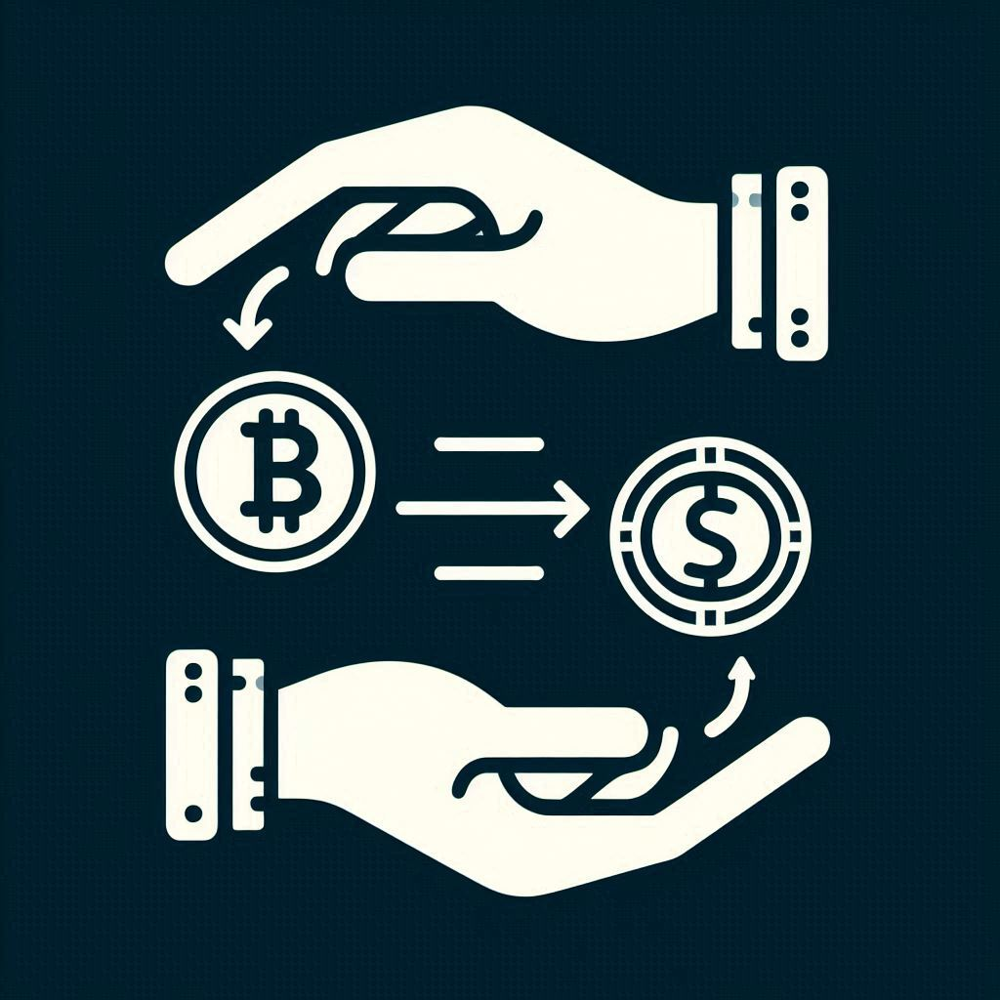
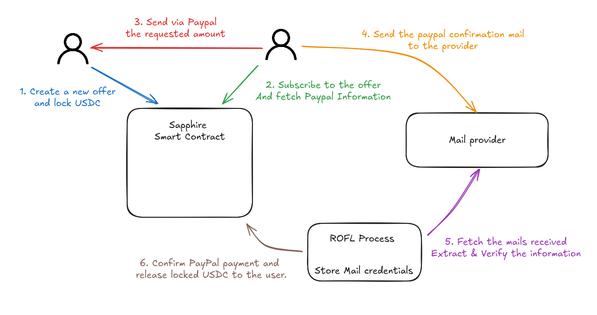

<a id="readme-top"></a>

<br />
<div align="center">
  <a href="#">
    
  </a>

<h3 align="center">ZK-Pal - Crypto On/Off-Ramps via PayPal</h3>
<p align="center" style="font-style: italic; font-size: 1.2em;">Built during <a href="https://www.ethdam.com/">ETH Dam III</a></p>
  <p align="center">
    Reinventing Crypto Access: A Decentralized Peer-to-Peer PayPal Exchange
    <br />
    <br />
    <a href="https://github.com/RegisGraptin/zk-pal">Code</a>
    &middot;
    <a href="https://zk-pal.vercel.app/">View Demo</a>
    &middot;
    <a href="#">Video Presentation</a>
  </p>
</div>

Access to cryptocurrencies is becoming increasingly restrictive. Users must now go through centralized exchanges, complete KYC procedures, and wait for validation. ZK-Pal aims to restore trustless peer-to-peer exchange using PayPal as a fiat bridge.

Our objective is to offer an alternative aligned with the foundational principles of blockchain: decentralization and peer-to-peer exchange. By leveraging an existing payment system like PayPal, we aimed to enable users to buy and sell crypto without relying on centralized intermediaries. Through this project, we introduce an on-ramp/off-ramp mechanism where users can create and fulfill USDC offers in exchange for PayPal transfers.

The process begins when a user creates an offer on a smart contract deployed on Oasis Sapphire. This contract allows the user to lock a specified amount of USDC and securely store sensitive information, such as their PayPal handle, using Sapphire’s confidential features. Another user, interested in purchasing the USDC, can subscribe to this offer through the contract. After subscribing, the buyer must send the agreed amount via PayPal to the seller and retrieve the confirmation email from PayPal for this transaction.

The buyer forwards the PayPal confirmation email to a dedicated email address, accessible only by ROFL container. This container operates within a trusted execution environment (TEE) using Oasis's ROFL system. Its role is to automatically fetch incoming emails, verify their authenticity, extract the relevant details—such as the PayPal handle and transferred amount—and, upon successful validation, interact with the Sapphire smart contract to release the locked USDC to the buyer.

## Development Notes

Originally, we wanted to generate a zero-knowledge proof from the PayPal confirmation email. This proof would have allowed the smart contract to verify the email's authenticity, including the provider’s signature and transaction details, without exposing sensitive information. Once verified, the contract could autonomously unlock the USDC to the buyer.

However, during development, we encountered a critical limitation with the ZK-email approach: the size of PayPal’s confirmation emails exceeded the capacity of the Noir circuit, making it impossible to generate a valid proof. As a result, we pivoted to a more practical and scalable solution by leveraging Oasis’s ROFL system, which enables secure off-chain email processing through a trusted execution environment.

## Worflow illustration



## How to use it

### Smart contract deployment

On the smart contract side, we are using Sapphire network to deploy our smart contract. First you will need to install the dependencies and compile the smart contract.

```bash
cd contracts/
pnpm install
npx hardhat compile
```

You will have also to defined the private key used for the deployment. You can do it:

```bash
cp .env.example .env
# Fill in the file with your private key
```

> Notice: for the demo purpose, we have used a Mock ERC20 allowing us to facilitate the test. When using in production with real USDC, you will have to modify the ERC20 address in `contracts/ignition/modules/Escrow.ts`.

Then, you can deploy the `Escrow` smart contract by doing:

```bash
npx hardhat ignition deploy ./ignition/modules/Escrow.ts --network sapphire-testnet
```

> Notice here that we are deploying on `sapphire-testnet`. You may need to adapt based on your use case.

### Frontend

On the frontend side we are using next js. Again for using it you will have to install the dependencies and fill in the environment variable.

```bash
cd front
pnpm install
cp .env.example .env
```

For the environement variable, you will have to defined the `Escrow` smart contract address and the `USDC` contract address. Then, you can run it by executing:

```bash
pnpm dev
```
